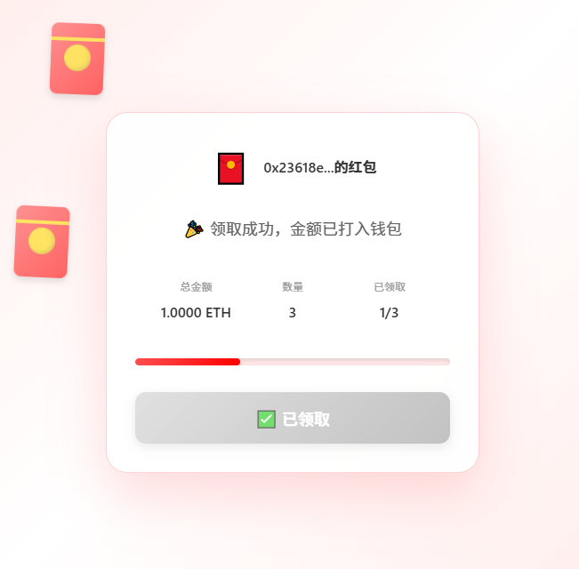

# Web3 链上红包 DApp

这是一个**100%去中心化**的区块链红包应用。用户可以连接钱包，设定金额和数量发送红包，然后通过链接分享给他人领取。所有数据和操作都基于区块链，完全不需要中心化服务器，整个过程安全、透明、可追溯。

## 功能亮点

- 🧧 **发送红包**: 连接钱包后，设置金额和数量发送红包到区块链
- 🎁 **领取红包**: 通过分享链接，别人可以连接钱包直接从区块链领取红包
- 🔗 **智能合约**: 使用 Solidity 编写的安全智能合约处理所有逻辑
- 🌐 **多链支持**: 支持本地测试网和 BSC 测试网
- 💼 **Web3 集成**: 使用 MetaMask 钱包连接
- 🚀 **完全去中心化**: 没有后端服务器，所有数据存储在区块链

## 技术栈

- **前端**：React 19、React Router 6、TypeScript、Vite、Ethers v6
- **合约层**：Hardhat、Solidity 0.8.x
- **工具**：ESLint、Prettier（在脚手架中默认启用）
- **不需要后端**: ❌ 零依赖服务器

## 快速启动

```bash
# 1. 安装项目依赖
npm install
cd react-dapp && npm install && cd ..

# 2. 启动本地区块链节点
npm run node

# 3. 部署智能合约（会写入 dapp/src/config/contractAddresses.json）
npm run deploy

# 4. 启动前端（Vite 开发服务器）
npm run frontend        # 或 cd react-dapp && npm run dev
```

前端默认在 `http://localhost:5173`，如果希望继续使用 `3000` 端口，可在 `react-dapp/.env` 中自定义 `VITE_PORT` 并传给 Vite（可选）。

## 目录结构

```
redpacket-web3/
├─ contracts/                # Solidity 智能合约
│  └─ RedPacket.sol
├─ react-dapp/               # 新的 React + Vite 前端
│  ├─ src/
│  │  ├─ components/         # 通用组件（钱包按钮、创建表单等）
│  │  ├─ config/             # ABI、合约地址配置
│  │  ├─ hooks/              # 自定义 hooks（useWallet）
│  │  ├─ pages/              # 页面（Home、ClaimPacket）
│  │  ├─ styles/             # 全局样式
│  │  ├─ utils/              # Web3 工具函数
│  │  └─ App.tsx             # 路由与布局
│  ├─ .env.example           # 前端所需的环境变量说明
│  └─ package.json
├─ scripts/
│  └─ deploy.js              # Hardhat 部署脚本（会自动写入前端配置）
├─ hardhat.config.js
└─ package.json              # 根目录脚本（Hardhat + 前端一键启动）
```

## 使用指南

### 创建红包
1. 打开前端并点击右上角「连接钱包」。
2. 填写红包总金额与份数，应用会在前端随机拆分金额。
3. 提交后在 MetaMask 中确认交易，等待区块确认。
4. 成功后可复制系统生成的领取链接，分享给朋友。

### 领取红包
1. 打开分享链接（URL 带有 `/claim/{packetId}`）。
2. 同样先连接钱包，然后点击「点击领取」。
3. 签名确认后等待区块打包，页面会显示结果与剩余份数。

## 环境变量

- `dapp/.env`（开发环境会自动忽略，请参考 `.env.example`）
  - `VITE_RPC_URL`：前端直连节点 RPC，默认为 `http://127.0.0.1:8545`
  - `VITE_CONTRACT_ADDRESS`：可覆盖部署脚本写入的地址
  - `VITE_CHAIN_ID`：前端提示使用的链 ID（十六进制）
- `root/.env`：若需要在 Hardhat 中引用私钥或 BSC RPC，可继续沿用原有写法。

## 智能合约（RedPacket.sol）

核心方法：

- `createRedPacket(bytes32 packetId, uint256 totalCount, uint256[] amounts)`：创建红包并把 ETH/BNB 存入合约。
- `claimRedPacket(bytes32 packetId, uint256 index)`：领取红包，并按照随机索引发放金额。
- `getPacketInfo(bytes32 packetId)`：查询红包总金额、数量、领取情况等。
- `hasClaimed(bytes32 packetId, address user)`：判断用户是否已经领取过。

Hardhat 节点或 BSC 测试网都可以复用以上接口，部署脚本会把最新地址同步到前端。若重新部署，请重新运行 `npm run deploy`。  

## 智能合约(USDC.sol)

- 编译全部合约

  `npx hardhat compile`
- 部署 ERC-20 USDC 代币

  `npx hardhat run scripts/deploy-usdc.js --network localhost`

- 命令

  - 进入Hardhat环境

  `npx hardhat console --network localhost`

  - 发送测试代币
  ```JavaScript
  const usdc = await ethers.getContractAt("USDC","0xe7f1725E7734CE288F8367e1Bb143E90bb3F0512");
  await usdc.transfer("0x23618e81E3f5cdF7f54C3d65f7FBc0aBf5B21E8f",ethers.utils.parseUnits("1000", 6));
  ```

  - 查询余额
  ```js
  const balance = await usdc.balanceOf("0x23618e81E3f5cdF7f54C3d65f7FBc0aBf5B21E8f");
  console.log(ethers.utils.formatUnits(balance, 6));
  ```

## 网络

### Local Hardhat
- Network Name: Hardhat Localhost  
- RPC URL: http://127.0.0.1:8545  
- Chain ID: 1337 (0x7a69)  
- Currency Symbol: ETH  
- Block Explorer: 无（本地节点控制台查看）

### BSC Testnet
- Network Name: BSC Testnet
- RPC URL: https://data-seed-prebsc-1-s1.binance.org:8545
- Chain ID: 97
- Currency Symbol: tBNB
- Block Explorer: https://testnet.bscscan.com


## 常见问题

- **如何使用 BSC Testnet？**  
  在 Hardhat 配置中增加 BSC 网络并部署，或将 `VITE_RPC_URL` 指向 BSC 节点，同时把 `VITE_CONTRACT_ADDRESS` 改为对应的链上地址即可。

祝你抢红包愉快！🧨


> ⚠️ 提醒：本项目仅用于功能与可行性测试，尚未部署至测试网或主网，未经过完整安全测试，请勿用于实际资产操作，由此产生的风险需自行承担。



